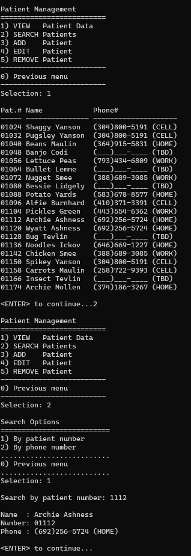
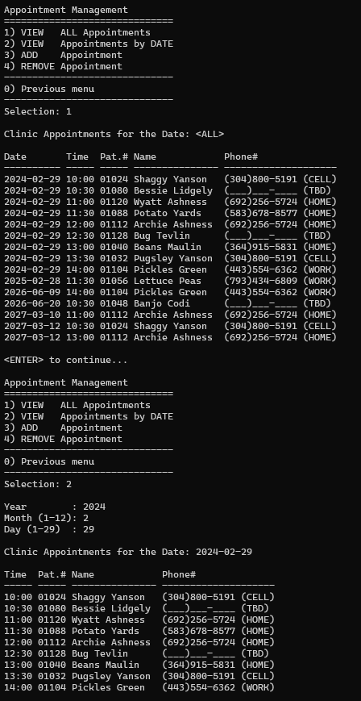

# Veterinary_Clinic_Appointment_System

## Description

The Veterinary Clinic System is a comprehensive software solution designed to streamline the management of a veterinary clinic's patient data and appointment scheduling. This system allows veterinary clinics to efficiently manage their patient records, appointments, and appointment schedules.

## Features

- **Patient Management:** Easily add, edit, and remove patient records, including patient numbers, names, and contact information.

- **Appointment Scheduling:** Schedule and manage appointments for patients, including date, time, and patient details.

- **Data Import/Export:** Import patient and appointment data from text files to quickly populate the system. Export data for backup and reporting.

- **User-Friendly Interface:** A user-friendly interface makes it simple for clinic staff to use the system effectively.
- 

